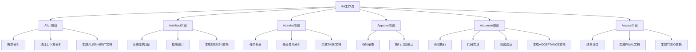
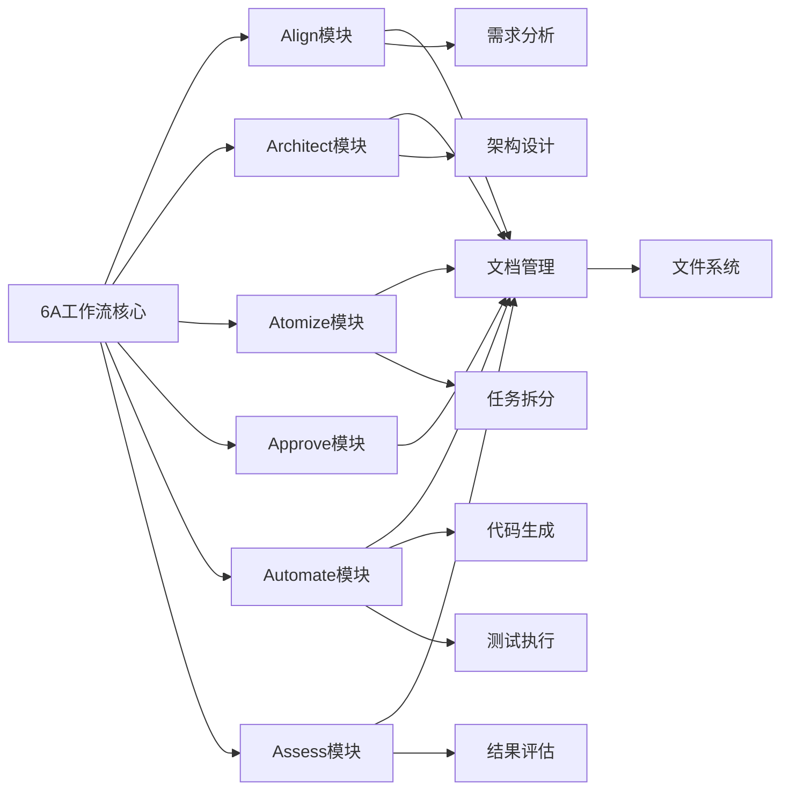
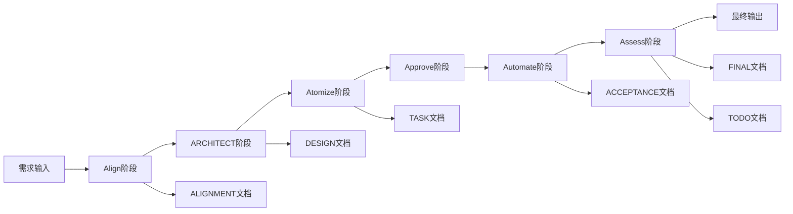

# 6A工作流 - Design阶段文档

## 整体架构图

## 分层设计和核心组件

### 6A工作流各阶段组件

1. **Align阶段组件**
   - 需求分析器
   - 项目上下文分析器
   - 文档生成器

2. **Architect阶段组件**
   - 架构设计工具
   - 模块设计工具
   - 图表生成器

3. **Atomize阶段组件**
   - 任务拆分器
   - 依赖分析器
   - 任务文档生成器

4. **Approve阶段组件**
   - 审查清单生成器
   - 审批流程管理器

5. **Automate阶段组件**
   - 任务执行引擎
   - 测试验证工具
   - 验收文档生成器

6. **Assess阶段组件**
   - 结果评估器
   - 报告生成器
   - 待办事项生成器

## 模块依赖关系图

## 接口契约定义

### 文档接口
- **文档创建接口**: create_document(type, content)
- **文档更新接口**: update_document(id, content)
- **文档查询接口**: get_document(type)

### 阶段执行接口
- **阶段启动接口**: start_phase(phase_name)
- **阶段状态查询接口**: get_phase_status(phase_name)
- **阶段完成接口**: complete_phase(phase_name, result)

## 数据流向图

## 异常处理策略

1. **文档生成失败**
   - 记录错误日志
   - 提供重试机制
   - 通知相关人员

2. **阶段执行异常**
   - 暂停当前阶段
   - 记录异常信息
   - 提供恢复机制

3. **依赖缺失**
   - 检查依赖完整性
   - 提示缺失项
   - 提供解决建议