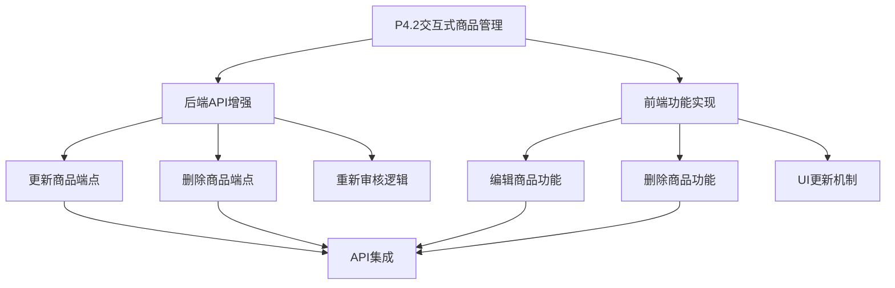
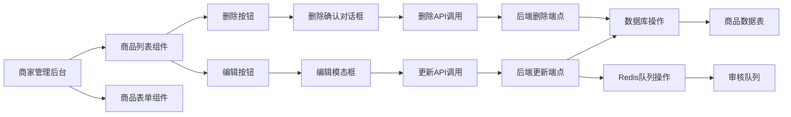
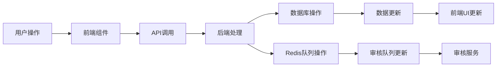

# P4.2 交互式商品管理 - Design阶段文档

## 整体架构图

## 分层设计和核心组件

### 后端组件设计

1. **商品更新端点**
   - 路径: PUT /api/v1/products/{product_id}
   - 功能: 更新商品信息并重新提交审核
   - 权限: 仅商品所有者可操作
   - 逻辑: 更新数据库记录，重置审核状态，重新排队审核

2. **商品删除端点**
   - 路径: DELETE /api/v1/products/{product_id}
   - 功能: 删除商品（软删除）
   - 权限: 仅商品所有者可操作
   - 逻辑: 将商品状态设置为"discontinued"

3. **审核重新提交逻辑**
   - 当商品信息更新后，自动将商品状态重置为"pending_moderation"
   - 将商品ID重新推送到Redis审核队列

### 前端组件设计

1. **商品编辑功能**
   - 在商品列表中添加"编辑"按钮
   - 点击后弹出编辑模态框
   - 模态框中显示商品当前信息的表单
   - 提交后调用后端更新API

2. **商品删除功能**
   - 在商品列表中添加"删除"按钮
   - 点击后弹出确认对话框
   - 确认后调用后端删除API

3. **UI更新机制**
   - 操作成功后自动刷新商品列表
   - 显示操作结果提示信息
   - 在更新商品后显示"审核中"状态

## 模块依赖关系图

## 接口契约定义

### 后端API接口

1. **更新商品接口**
   - 方法: PUT
   - 路径: /api/v1/products/{product_id}
   - 请求体: ProductUpdate对象
   - 响应: ProductRead对象
   - 状态码: 200 (成功)

2. **删除商品接口**
   - 方法: DELETE
   - 路径: /api/v1/products/{product_id}
   - 响应: SuccessResponse对象
   - 状态码: 200 (成功) 或 204 (无内容)

### 前端组件接口

1. **ProductList组件**
   - Props: onEdit, onDelete
   - Events: editProduct, deleteProduct

2. **ProductForm组件**
   - Props: productId, onCancel, onSuccess
   - Events: formSubmit, formCancel

## 数据流向图

## 异常处理策略

1. **权限验证失败**
   - 返回403状态码
   - 前端显示权限错误提示

2. **商品不存在**
   - 返回404状态码
   - 前端显示商品不存在提示

3. **网络请求失败**
   - 前端显示网络错误提示
   - 提供重试机制

4. **表单验证失败**
   - 后端返回422状态码
   - 前端显示验证错误信息

5. **服务器内部错误**
   - 返回500状态码
   - 前端显示通用错误提示