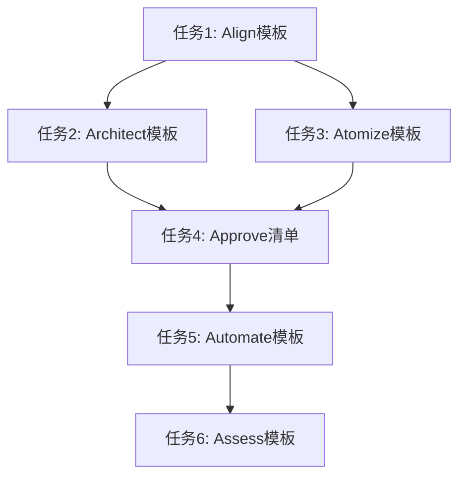

# 6A工作流 - Task阶段文档

## 原子任务拆分

### 任务1: 创建Align阶段文档模板
- **输入契约**:
  - 前置依赖: 项目需求文档
  - 输入数据: 项目背景信息、技术栈信息
  - 环境依赖: Markdown编辑器、文档存储目录

- **输出契约**:
  - 输出数据: ALIGNMENT_*.md模板文件
  - 交付物: 可复用的Align阶段文档模板
  - 验收标准: 模板包含所有必要章节，格式正确

- **实现约束**:
  - 技术栈: Markdown
  - 接口规范: 遵循项目文档规范
  - 质量要求: 清晰、完整、易于理解

- **依赖关系**:
  - 后置任务: Architect阶段任务
  - 并行任务: 无

### 任务2: 创建Architect阶段文档模板
- **输入契约**:
  - 前置依赖: Align阶段文档
  - 输入数据: 系统架构信息、设计原则
  - 环境依赖: Markdown编辑器、图表工具

- **输出契约**:
  - 输出数据: DESIGN_*.md模板文件
  - 交付物: 可复用的Architect阶段文档模板
  - 验收标准: 模板包含架构图、设计说明等

- **实现约束**:
  - 技术栈: Markdown、Mermaid
  - 接口规范: 遵循项目文档规范
  - 质量要求: 图表清晰、设计说明详细

- **依赖关系**:
  - 后置任务: Atomize阶段任务
  - 并行任务: 任务3

### 任务3: 创建Atomize阶段文档模板
- **输入契约**:
  - 前置依赖: Architect阶段文档
  - 输入数据: 系统设计文档、功能需求
  - 环境依赖: Markdown编辑器、任务管理工具

- **输出契约**:
  - 输出数据: TASK_*.md模板文件
  - 交付物: 可复用的Atomize阶段文档模板
  - 验收标准: 模板包含任务拆分、依赖关系等

- **实现约束**:
  - 技术栈: Markdown、Mermaid
  - 接口规范: 遵循项目文档规范
  - 质量要求: 任务描述清晰、依赖关系明确

- **依赖关系**:
  - 后置任务: Approve阶段任务
  - 并行任务: 任务2

### 任务4: 创建Approve阶段检查清单
- **输入契约**:
  - 前置依赖: Atomize阶段文档
  - 输入数据: 任务拆分文档、验收标准
  - 环境依赖: Markdown编辑器

- **输出契约**:
  - 输出数据: 审批检查清单
  - 交付物: 可复用的审批检查模板
  - 验收标准: 检查项完整、标准明确

- **实现约束**:
  - 技术栈: Markdown
  - 接口规范: 遵循项目文档规范
  - 质量要求: 检查项无遗漏、标准可执行

- **依赖关系**:
  - 后置任务: Automate阶段任务
  - 并行任务: 无

### 任务5: 创建Automate阶段文档模板
- **输入契约**:
  - 前置依赖: Approve阶段文档
  - 输入数据: 审批通过的任务清单
  - 环境依赖: Markdown编辑器、代码编辑器

- **输出契约**:
  - 输出数据: ACCEPTANCE_*.md模板文件
  - 交付物: 可复用的Automate阶段文档模板
  - 验收标准: 模板包含执行记录、测试结果等

- **实现约束**:
  - 技术栈: Markdown
  - 接口规范: 遵循项目文档规范
  - 质量要求: 执行记录详细、结果可追溯

- **依赖关系**:
  - 后置任务: Assess阶段任务
  - 并行任务: 无

### 任务6: 创建Assess阶段文档模板
- **输入契约**:
  - 前置依赖: Automate阶段文档
  - 输入数据: 执行结果、评估标准
  - 环境依赖: Markdown编辑器

- **输出契约**:
  - 输出数据: FINAL_*.md和TODO_*.md模板文件
  - 交付物: 可复用的Assess阶段文档模板
  - 验收标准: 模板包含评估结果、待办事项等

- **实现约束**:
  - 技术栈: Markdown
  - 接口规范: 遵循项目文档规范
  - 质量要求: 评估全面、待办明确

- **依赖关系**:
  - 后置任务: 无
  - 并行任务: 无

## 任务依赖图

