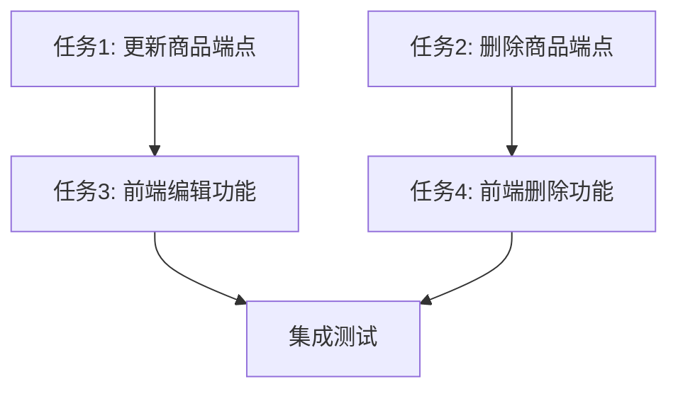

# P4.2 交互式商品管理 - Task阶段文档

## 原子任务拆分

### 任务1: 增强后端API - 添加更新商品端点
- **输入契约**:
  - 前置依赖: 商品模型和现有API端点
  - 输入数据: ProductUpdate对象，包含要更新的字段
  - 环境依赖: FastAPI框架、SQLAlchemy、Redis

- **输出契约**:
  - 输出数据: 更新后的ProductRead对象
  - 交付物: PUT /api/v1/products/{product_id}端点
  - 验收标准: 端点能正确更新商品信息并重新提交审核

- **实现约束**:
  - 技术栈: Python, FastAPI, SQLAlchemy
  - 接口规范: RESTful API规范
  - 质量要求: 代码符合项目规范，有适当的错误处理

- **依赖关系**:
  - 后置任务: 前端编辑功能实现
  - 并行任务: 任务2

### 任务2: 增强后端API - 添加删除商品端点
- **输入契约**:
  - 前置依赖: 商品模型和现有API端点
  - 输入数据: 商品ID
  - 环境依赖: FastAPI框架、SQLAlchemy

- **输出契约**:
  - 输出数据: SuccessResponse对象
  - 交付物: DELETE /api/v1/products/{product_id}端点
  - 验收标准: 端点能正确删除商品（软删除）

- **实现约束**:
  - 技术栈: Python, FastAPI, SQLAlchemy
  - 接口规范: RESTful API规范
  - 质量要求: 代码符合项目规范，有适当的错误处理

- **依赖关系**:
  - 后置任务: 前端删除功能实现
  - 并行任务: 任务1

### 任务3: 实现前端编辑商品功能
- **输入契约**:
  - 前置依赖: 后端更新API端点、ProductList组件
  - 输入数据: 商品ID和更新信息
  - 环境依赖: React、Ant Design、productAPI服务

- **输出契约**:
  - 输出数据: 更新后的商品信息
  - 交付物: 商品编辑模态框和相关功能
  - 验收标准: 用户能通过界面编辑商品信息并成功提交

- **实现约束**:
  - 技术栈: React, TypeScript, Ant Design
  - 接口规范: 与后端API保持一致
  - 质量要求: UI友好，有表单验证，错误处理完善

- **依赖关系**:
  - 后置任务: 无
  - 并行任务: 任务4

### 任务4: 实现前端删除商品功能
- **输入契约**:
  - 前置依赖: 后端删除API端点、ProductList组件
  - 输入数据: 商品ID
  - 环境依赖: React、Ant Design、productAPI服务

- **输出契约**:
  - 输出数据: 无
  - 交付物: 商品删除功能和确认对话框
  - 验收标准: 用户能通过界面删除商品，并有安全确认机制

- **实现约束**:
  - 技术栈: React, TypeScript, Ant Design
  - 接口规范: 与后端API保持一致
  - 质量要求: 操作安全，有确认机制，错误处理完善

- **依赖关系**:
  - 后置任务: 无
  - 并行任务: 任务3

## 任务依赖图

