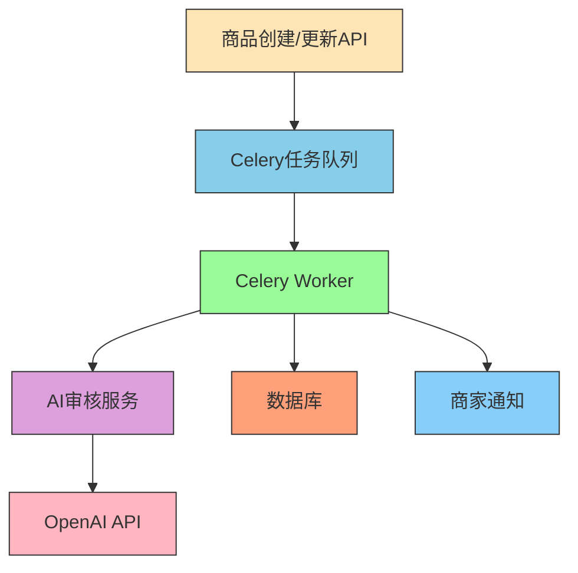

# AI驱动内容审核架构设计文档

本文档详细说明了平台中新的AI驱动内容审核系统的架构设计和实现。

## 概述

为了将内容审核从简单的人工规则转变为智能的AI驱动审核，我们集成了OpenAI作为AI服务提供商，实现了自动化的商品内容审核功能。

## 架构设计

### 核心组件

1. **AI审核服务**: 基于OpenAI的智能内容审核服务
2. **审核Prompt**: 精心设计的系统提示词，指导AI进行内容审核
3. **Celery任务**: 异步处理商品审核任务
4. **数据库存储**: 存储审核结果和备注信息

### 系统架构图



## 实现详情

### AI审核服务

AI审核服务实现在 `app/services/ai/moderation.py` 中：

```python
def get_moderation_decision(product_name: str, product_description: str) -> ModerationResult:
    """
    使用OpenAI审核商品内容
    
    Args:
        product_name: 商品名称
        product_description: 商品描述
        
    Returns:
        ModerationResult: 审核结果
    """
```

### 系统Prompt设计

我们设计了清晰的系统Prompt来指导AI进行内容审核：

```
You are a strict but fair e-commerce content moderator for a platform called 'ShopSphere'.
Your task is to determine if a product complies with our policies. 
Prohibited items include, but are not limited to: weapons, illegal drugs, hate speech, counterfeit goods, and adult content.
You will be given a product name and description.
You MUST respond with a JSON object containing two keys: 
'decision' (either 'approved' or 'rejected') and 
'reason' (a brief, clear explanation for your decision, especially if rejected).
```

### Celery任务集成

在Celery任务中调用AI审核服务：

```python
@celery_app.task(bind=True, max_retries=3, default_retry_delay=60)
def moderate_product(self, product_id: str):
    # 获取商品信息
    product_info = get_product_info(product_id)
    
    # 调用AI审核服务
    moderation_result = get_moderation_decision(
        product_info["name"], 
        product_info["description"] or ""
    )
    
    # 根据AI结果更新商品状态和审核备注
    update_product_status_with_notes(product_id, new_status, reason)
```

## 配置说明

### 环境变量配置

```env
# AI 服务配置
OPENAI_API_KEY=your_openai_api_key_here
OPENAI_MODEL=gpt-3.5-turbo
OPENAI_MAX_TOKENS=1000
AI_MODERATION_ENABLED=True
AI_MODERATION_THRESHOLD=0.8
```

### 配置项说明

| 配置项 | 说明 | 默认值 |
|--------|------|--------|
| OPENAI_API_KEY | OpenAI API密钥 |  |
| OPENAI_MODEL | OpenAI模型 | gpt-3.5-turbo |
| OPENAI_MAX_TOKENS | 最大token数 | 1000 |
| AI_MODERATION_ENABLED | 是否启用AI审核 | True |
| AI_MODERATION_THRESHOLD | AI审核阈值 | 0.8 |

## 数据库模型扩展

### 产品模型更新

在 `app/models/product.py` 中添加了新的字段：

```python
class Product(Base):
    # ... 其他字段 ...
    
    # AI审核备注
    moderation_notes = Column(Text, nullable=True, comment="AI审核备注")
    
    # ... 其他字段 ...
```

### 数据库迁移

创建了新的Alembic迁移文件来添加 `moderation_notes` 字段：

```python
def upgrade():
    op.add_column('products', sa.Column('moderation_notes', sa.Text(), nullable=True, comment='AI审核备注'))

def downgrade():
    op.drop_column('products', 'moderation_notes')
```

## API端点更新

### 状态更新端点

更新了 `/api/v1/products/{product_id}/status` 端点，使其能够接受和处理 `moderation_notes` 字段：

```python
class StatusUpdate(BaseModel):
    status: str
    moderation_notes: Optional[str] = None
```

## 安全性

- API密钥通过环境变量配置，不在代码中硬编码
- 使用HTTPS与OpenAI API通信
- 实现了错误处理和重试机制
- 审核结果存储在数据库中，供商家查看

## 扩展性

该架构设计具有良好的扩展性：

1. **模型切换**: 可以轻松切换不同的OpenAI模型
2. **审核规则**: 可以通过更新系统Prompt来调整审核规则
3. **多语言支持**: 可以扩展支持多语言内容审核
4. **审核历史**: 审核结果存储在数据库中，便于审计和分析

## 监控和日志

- 详细的日志记录审核过程
- 错误处理和重试机制
- 审核结果存储便于后续分析