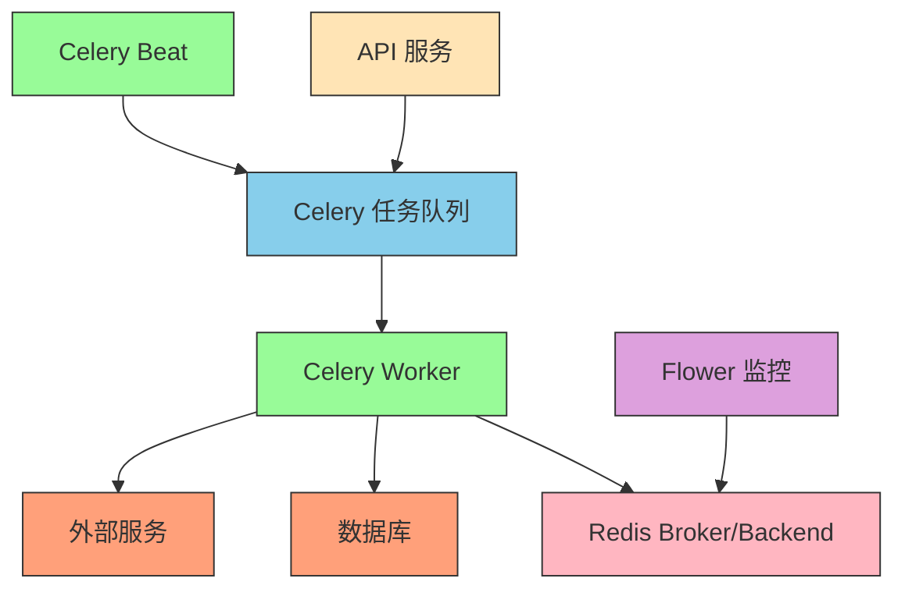

# Celery 架构设计文档

本文档详细说明了平台中新的基于 Celery 的异步任务处理架构的设计和实现。

## 概述

为了将后台处理从简单的脚本升级为分布式、容错的系统，我们集成了 Celery 作为异步任务处理框架。Celery 与 Redis 配合使用，提供了可靠性、可扩展性和监控能力。

## 架构设计

### 核心组件

1. **Celery 应用**: 配置和管理 Celery 任务的核心应用实例
2. **任务队列**: 使用 Redis 作为消息代理和结果后端
3. **Worker 进程**: 执行异步任务的工作进程
4. **Beat 调度器**: 管理定时任务的调度器
5. **Flower 监控**: 提供 Web 界面实时监控 Celery 任务

### 系统架构图



## 实现详情

### Celery 应用配置

Celery 应用配置在 `app/core/celery_app.py` 中：

```python
from celery import Celery
from app.config import settings

# 创建 Celery 应用实例
celery_app = Celery(
    "telegram_bot_platform",
    broker=str(settings.CELERY_BROKER_URL),
    backend=str(settings.CELERY_RESULT_BACKEND),
    include=["app.tasks"],
)

# Celery 配置
celery_app.conf.update(
    # 任务序列化
    task_serializer="json",
    accept_content=["json"],
    result_serializer="json",
    
    # 时区配置
    timezone="Asia/Shanghai",
    enable_utc=True,
    
    # 结果过期时间
    result_expires=3600,
    
    # 任务路由
    task_routes={
        "app.tasks.ai_moderation.*": {"queue": "ai_moderation"},
        "app.tasks.notifications.*": {"queue": "notifications"},
    },
    
    # 工作进程配置
    worker_prefetch_multiplier=1,
    task_acks_late=True,
    
    # 任务重试配置
    task_default_retry_delay=60,
    task_max_retries=3,
    
    # 监控配置
    worker_send_task_events=True,
    task_send_sent_event=True,
    
    # 定时任务
    beat_schedule={
        "cleanup-expired-ads": {
            "task": "app.tasks.cleanup_expired_ads",
            "schedule": 3600.0,  # 每小时运行一次
        },
        "update-user-statistics": {
            "task": "app.tasks.update_user_statistics", 
            "schedule": 7200.0,  # 每2小时运行一次
        },
    },
)
```

### 商品审核任务

商品审核任务实现在 `app/tasks/moderation.py` 中：

```python
@celery_app.task(bind=True, max_retries=3, default_retry_delay=60)
def moderate_product(self, product_id: str):
    """
    商品审核 Celery 任务
    
    Args:
        product_id (str): 商品ID
        
    Returns:
        dict: 审核结果
    """
    # 任务实现...
```

### API 端点集成

在 API 端点中，通过调用 `.delay()` 方法异步触发任务：

```python
from app.tasks.moderation import moderate_product

# 异步触发商品审核任务
moderate_product.delay(str(db_product.id))
```

## 配置说明

### 环境变量配置

```env
# Celery 配置
CELERY_BROKER_URL=redis://localhost:6379/1
CELERY_RESULT_BACKEND=redis://localhost:6379/2
```

### 配置项说明

| 配置项 | 说明 | 默认值 |
|--------|------|--------|
| CELERY_BROKER_URL | Celery 消息代理 URL | redis://localhost:6379/1 |
| CELERY_RESULT_BACKEND | Celery 结果后端 URL | redis://localhost:6379/2 |

## 部署指南

### Docker Compose 配置

在 `docker-compose.yml` 中配置了以下服务：

1. **celery-worker**: Celery 工作进程
2. **celery-beat**: Celery 定时任务调度器
3. **flower**: Celery 监控界面

```yaml
# Celery Worker 异步任务处理
celery-worker:
  build:
    context: .
    dockerfile: Dockerfile
    target: development
  container_name: telegram-bot-celery-worker
  environment:
    - CELERY_BROKER_URL=redis://redis:6379/1
    - CELERY_RESULT_BACKEND=redis://redis:6379/2
  volumes:
    - .:/app
  depends_on:
    - redis
  networks:
    - telegram-bot-network
  restart: unless-stopped
  command: celery -A app.core.celery_app worker --loglevel=info

# Celery Beat 定时任务调度
celery-beat:
  build:
    context: .
    dockerfile: Dockerfile
    target: development
  container_name: telegram-bot-celery-beat
  environment:
    - CELERY_BROKER_URL=redis://redis:6379/1
    - CELERY_RESULT_BACKEND=redis://redis:6379/2
  volumes:
    - .:/app
  depends_on:
    - redis
  networks:
    - telegram-bot-network
  restart: unless-stopped
  command: celery -A app.core.celery_app beat --loglevel=info

# Flower Celery 监控界面
flower:
  build:
    context: .
    dockerfile: Dockerfile
    target: development
  container_name: telegram-bot-flower
  environment:
    - CELERY_BROKER_URL=redis://redis:6379/1
    - CELERY_RESULT_BACKEND=redis://redis:6379/2
  ports:
    - "5555:5555"
  depends_on:
    - redis
  networks:
    - telegram-bot-network
  restart: unless-stopped
  command: celery -A app.core.celery_app flower --port=5555
```

## 监控和管理

### Flower 监控界面

Flower 提供了 Web 界面来监控 Celery 任务：

- **URL**: http://localhost:5555
- **功能**:
  - 实时查看 Worker 状态
  - 监控任务队列
  - 查看成功/失败的任务
  - 任务执行时间统计
  - Worker 性能指标

### 任务重试机制

Celery 任务具有内置的重试机制：

```python
@celery_app.task(bind=True, max_retries=3, default_retry_delay=60)
def moderate_product(self, product_id: str):
    try:
        # 任务逻辑
        pass
    except Exception as exc:
        # 重试逻辑
        if self.request.retries < self.max_retries:
            raise self.retry(exc=exc)
```

## 扩展性

该架构设计具有良好的扩展性：

1. **水平扩展**: 可以启动多个 Worker 进程处理任务
2. **任务路由**: 支持将不同类型的任务路由到不同的队列
3. **定时任务**: 支持周期性任务调度
4. **监控集成**: 集成 Flower 提供完整的监控能力

## 安全性

- 任务参数序列化使用 JSON 格式
- Worker 进程隔离执行任务
- 支持任务结果过期时间设置
- 遵循最小权限原则配置 Redis 访问