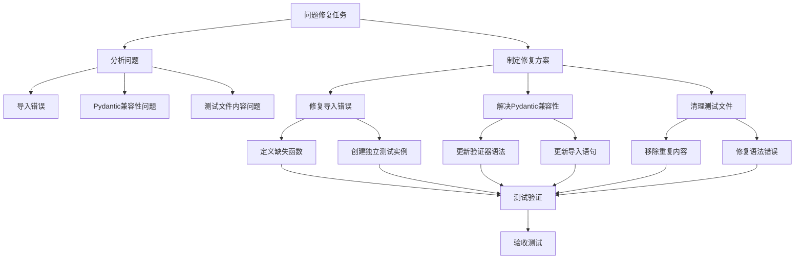
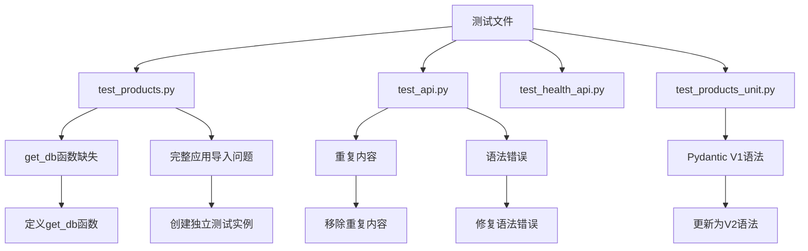
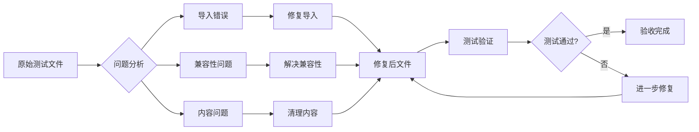

# 问题修复设计文档

## 整体架构图

## 分层设计和核心组件

### 问题分析层
1. 导入错误分析组件
2. Pydantic兼容性分析组件
3. 测试文件内容分析组件

### 修复执行层
1. 导入错误修复组件
2. Pydantic兼容性修复组件
3. 测试文件清理组件

### 验证层
1. 单元测试验证组件
2. 集成测试验证组件
3. 验收测试验证组件

## 模块依赖关系图

## 接口契约定义

### 修复导入错误接口
- 输入：包含错误导入的测试文件
- 输出：修复后的测试文件
- 前置条件：确定缺失的函数和依赖项
- 后置条件：测试文件能够正常导入

### 解决Pydantic兼容性接口
- 输入：使用V1语法的Pydantic模型
- 输出：使用V2语法的Pydantic模型
- 前置条件：了解Pydantic V1到V2的迁移指南
- 后置条件：模型能够正常工作

### 清理测试文件接口
- 输入：包含错误内容的测试文件
- 输出：清理后的测试文件
- 前置条件：识别错误内容
- 后置条件：测试文件内容正确

## 数据流向图

## 异常处理策略

1. **导入错误处理**：
   - 如果修复导入后仍有问题，创建最小化测试实例
   - 使用mock对象替换无法导入的依赖

2. **兼容性问题处理**：
   - 如果V2语法导致其他问题，查阅官方迁移文档
   - 逐步替换，确保每步都能正常工作

3. **内容错误处理**：
   - 如果清理后测试失败，逐步恢复并定位问题
   - 使用版本控制对比修改前后的差异

## 质量门控

1. 架构图清晰准确
2. 接口定义完整
3. 与现有系统无冲突
4. 设计可行性验证通过