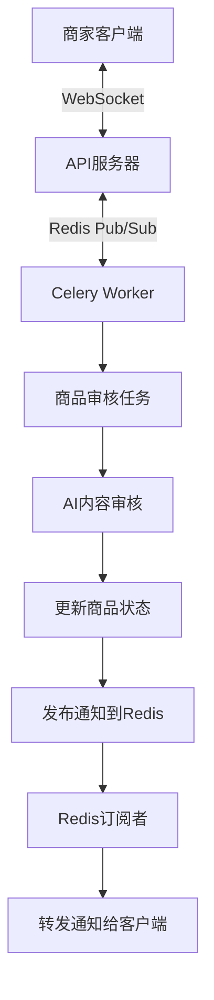
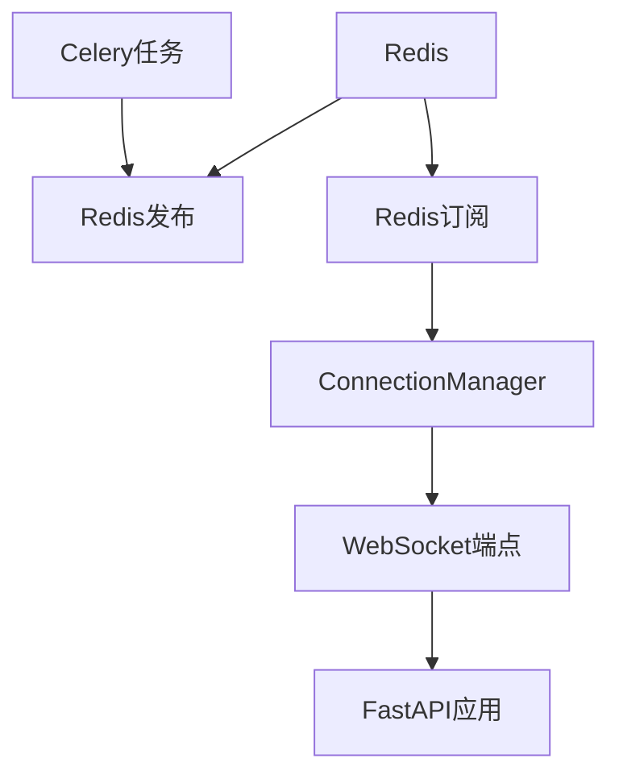
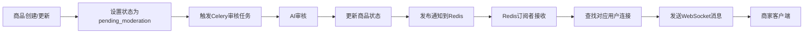

# P4.7 架构设计文档：实时用户体验 - WebSocket 通知集成

## 整体架构图



## 分层设计和核心组件

### 1. WebSocket连接管理层
- **ConnectionManager类**: 管理所有活跃的WebSocket连接
- 功能: 连接建立、断开、消息发送

### 2. WebSocket API端点层
- **notifications.py**: WebSocket路由端点
- 功能: 处理客户端连接请求

### 3. 消息总线层
- **Redis Pub/Sub**: 解耦Celery Worker和API服务器
- 功能: 消息发布和订阅

### 4. 通知发布层
- **moderation.py**: Celery任务中发布通知
- 功能: 审核完成后发布通知消息

### 5. 消息订阅层
- **main.py**: Redis订阅者
- 功能: 监听通知消息并转发给客户端

## 模块依赖关系图



## 接口契约定义

### ConnectionManager接口
```python
class ConnectionManager:
    def connect(self, websocket: WebSocket, user_id: str) -> None
    def disconnect(self, websocket: WebSocket, user_id: str) -> None
    def send_personal_message(self, message: dict, user_id: str) -> None
```

### WebSocket端点接口
```python
@router.websocket("/ws/{user_id}")
async def websocket_endpoint(websocket: WebSocket, user_id: str) -> None
```

### 通知消息格式
```json
{
    "type": "product_moderation_update",
    "product_id": 123,
    "status": "approved",
    "moderation_notes": "Content is appropriate for the platform.",
    "timestamp": "2023-01-01T00:00:00Z"
}
```

## 数据流向图



## 异常处理策略

1. **WebSocket连接异常**: 
   - 连接断开时自动从管理器中移除
   - 客户端可实现重连机制

2. **Redis连接异常**:
   - 记录日志并继续运行
   - 提供降级机制（如不发送通知）

3. **消息处理异常**:
   - 消息格式错误时记录日志
   - 单个消息处理失败不影响其他消息

4. **用户无连接**:
   - 消息发送失败时记录日志
   - 不影响系统正常运行