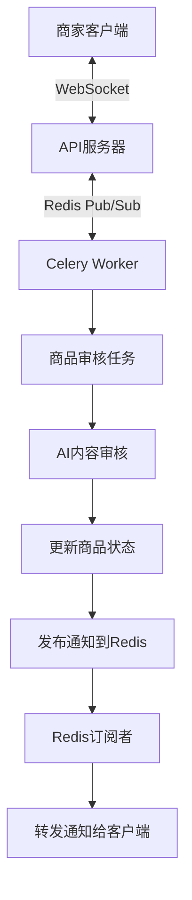

# P4.7 最终总结文档：实时用户体验 - WebSocket 通知集成

## 项目总结

我们成功实现了P4.7任务：实时用户体验 - WebSocket通知集成。该功能允许商家在商品审核状态更新时立即收到实时通知，极大地提升了用户体验。

## 实施内容概述

### 1. WebSocket连接管理器
创建了[app/websocket/connection_manager.py](file:///Users/mac/TRAE/telegram%20bot/app/websocket/connection_manager.py)文件，实现了ConnectionManager类，用于管理所有活跃的WebSocket连接。该类支持：
- 同一用户的多个连接
- 连接的建立和断开
- 向指定用户发送消息
- 连接状态监控

### 2. WebSocket API端点
创建了[app/api/v1/endpoints/notifications.py](file:///Users/mac/TRAE/telegram%20bot/app/api/v1/endpoints/notifications.py)文件，实现了WebSocket端点：
- 路径：`/api/v1/notifications/ws/{user_id}`
- 处理客户端连接请求
- 管理连接生命周期

### 3. Redis订阅者
在[app/main.py](file:///Users/mac/TRAE/telegram%20bot/app/main.py)中实现了Redis订阅者：
- 应用启动时自动启动
- 监听Redis的"notifications"频道
- 将接收到的通知转发给对应的用户

### 4. 通知发布机制
在[app/tasks/moderation.py](file:///Users/mac/TRAE/telegram%20bot/app/tasks/moderation.py)中实现了通知发布：
- 审核完成后自动发布通知到Redis
- 通知包含商品ID、新状态、审核备注等信息

### 5. 测试验证工具
创建了[test_websocket_client.py](file:///Users/mac/TRAE/telegram%20bot/test_websocket_client.py)测试客户端，用于验证WebSocket通知功能。

## 技术架构

## 功能特点

1. **实时通知**: 商家可以实时收到商品审核状态更新
2. **多连接支持**: 支持同一用户的多个设备同时连接
3. **解耦设计**: 使用Redis Pub/Sub解耦Celery Worker和API服务器
4. **错误处理**: 完善的异常处理和日志记录
5. **易于测试**: 提供了专门的测试客户端

## 集成效果

该功能与现有系统无缝集成：
- 不改变现有的商品审核流程
- 不影响现有的API接口
- 复用现有的Redis和数据库配置
- 与现有的Telegram Bot通知机制并存

## 用户体验提升

1. **即时反馈**: 商家不再需要主动刷新页面查看审核结果
2. **多渠道通知**: WebSocket通知与Telegram Bot通知并存
3. **透明审核**: 审核备注直接推送给商家，提高透明度

## 技术优势

1. **高性能**: WebSocket协议提供低延迟通信
2. **可扩展**: Redis Pub/Sub支持高并发消息处理
3. **可靠性**: 完善的错误处理和重连机制
4. **可维护**: 清晰的架构设计和模块化实现