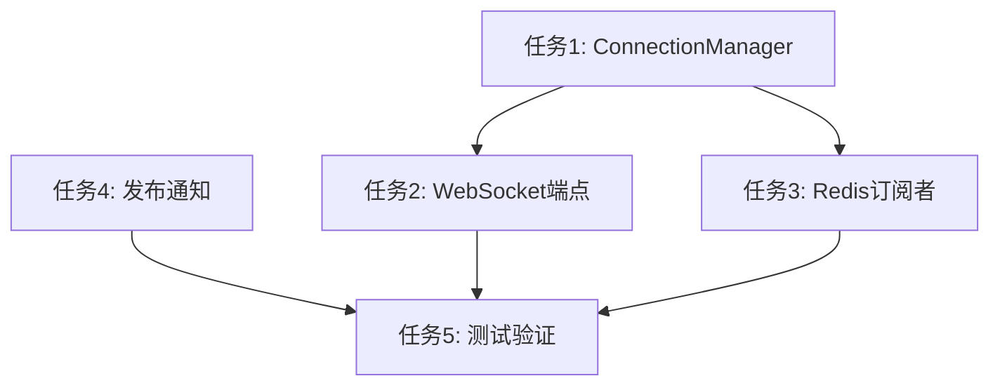

# P4.7 任务分解文档：实时用户体验 - WebSocket 通知集成

## 原子任务拆分

### 任务1: 实现WebSocket连接管理器
**模块**: app/websocket/connection_manager.py
**类**: ConnectionManager

#### 输入契约
- 前置依赖: FastAPI WebSocket支持
- 输入数据: WebSocket对象, user_id字符串
- 环境依赖: Python 3.9+, FastAPI

#### 输出契约
- 输出数据: 连接管理功能
- 交付物: ConnectionManager类
- 验收标准: 
  1. 能够正确添加和移除连接
  2. 能够向指定用户发送消息
  3. 支持同一用户的多个连接

#### 实现约束
- 使用Python字典存储连接映射
- 线程安全处理
- 异常处理机制

#### 依赖关系
- 后置任务: WebSocket API端点实现
- 并行任务: 无

### 任务2: 创建WebSocket API端点
**模块**: app/api/v1/endpoints/notifications.py
**路由**: @router.websocket("/ws/{user_id}")

#### 输入契约
- 前置依赖: ConnectionManager类
- 输入数据: WebSocket连接请求, user_id路径参数
- 环境依赖: FastAPI应用, ConnectionManager

#### 输出契约
- 输出数据: WebSocket端点
- 交付物: notifications.py文件
- 验收标准:
  1. 客户端可以成功建立WebSocket连接
  2. 连接断开时正确清理资源
  3. 与ConnectionManager正确集成

#### 实现约束
- 使用FastAPI WebSocket装饰器
- 实现连接生命周期管理
- 错误处理和日志记录

#### 依赖关系
- 前置任务: ConnectionManager实现
- 后置任务: 无
- 并行任务: Redis订阅者实现

### 任务3: 实现Redis订阅者
**模块**: app/main.py
**功能**: Redis消息订阅和转发

#### 输入契约
- 前置依赖: ConnectionManager类
- 输入数据: Redis通知消息
- 环境依赖: Redis连接, ConnectionManager

#### 输出契约
- 输出数据: Redis订阅者任务
- 交付物: main.py中的订阅者实现
- 验收标准:
  1. 应用启动时自动启动订阅者
  2. 能够接收Redis通知消息
  3. 正确转发消息给对应用户

#### 实现约束
- 使用FastAPI生命周期事件
- 异步任务处理
- 异常处理和重连机制

#### 依赖关系
- 前置任务: ConnectionManager实现
- 后置任务: 无
- 并行任务: WebSocket API端点实现

### 任务4: 在Celery任务中发布通知
**模块**: app/tasks/moderation.py
**功能**: 审核完成后发布通知

#### 输入契约
- 前置依赖: Redis连接
- 输入数据: 商品ID, 审核结果
- 环境依赖: Redis连接, 商品数据

#### 输出契约
- 输出数据: Redis通知消息
- 交付物: moderation.py中的通知发布代码
- 验收标准:
  1. 审核完成后正确发布通知
  2. 消息格式符合规范
  3. 异常情况下有日志记录

#### 实现约束
- 使用现有的Redis连接
- 消息格式标准化
- 异常处理机制

#### 依赖关系
- 前置任务: 无
- 后置任务: 无
- 并行任务: 其他任务

### 任务5: 测试验证
**模块**: test_websocket_client.py
**功能**: WebSocket通知功能测试

#### 输入契约
- 前置依赖: 所有上述功能实现
- 输入数据: 测试用户ID, 商品操作
- 环境依赖: 运行的API服务器, Celery Worker

#### 输出契约
- 输出数据: 测试结果
- 交付物: test_websocket_client.py测试脚本
- 验收标准:
  1. 能够建立WebSocket连接
  2. 能够接收审核通知
  3. 通知内容正确

#### 实现约束
- 使用websockets库
- 简单易用的测试脚本
- 清晰的输出信息

#### 依赖关系
- 前置任务: 所有实现任务
- 后置任务: 无
- 并行任务: 无

## 任务依赖图

## 质量门控

1. ✅ 任务覆盖完整需求
2. ✅ 依赖关系无循环
3. ✅ 每个任务都可独立验证
4. ✅ 复杂度评估合理