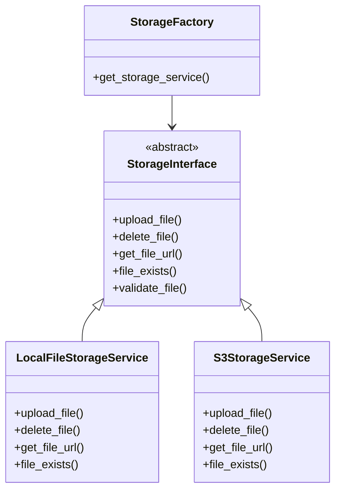

# 存储架构设计文档

本文档详细说明了平台中新的可插拔存储架构的设计和实现。

## 概述

为了使平台具备云原生的弹性，我们对存储层进行了重构，实现了可插拔的存储架构。该架构支持多种存储后端，包括本地文件系统和 Amazon S3，未来可以轻松扩展支持其他对象存储服务。

## 架构设计

### 核心组件

1. **存储接口 (StorageInterface)**: 定义了所有存储服务必须实现的方法
2. **本地存储服务 (LocalFileStorageService)**: 本地文件系统存储实现
3. **S3 存储服务 (S3StorageService)**: Amazon S3 存储实现
4. **存储工厂 (StorageFactory)**: 根据配置创建相应的存储服务实例

### 类图



## 接口定义

### StorageInterface

```python
class StorageInterface(ABC):
    @abstractmethod
    async def upload_file(
        self,
        file: BinaryIO,
        filename: str,
        content_type: str,
        folder: str = "uploads"
    ) -> StorageUploadResult:
        pass
    
    @abstractmethod
    async def delete_file(self, file_path: str) -> bool:
        pass
    
    @abstractmethod
    async def get_file_url(self, file_path: str) -> str:
        pass
    
    @abstractmethod
    async def file_exists(self, file_path: str) -> bool:
        pass
```

## 实现详情

### 本地存储服务

本地存储服务将文件保存在本地文件系统中，适用于开发和测试环境。

**特点**:
- 文件按日期组织: `folder/YYYY/MM/DD/uuid.ext`
- 支持配置存储路径和基础 URL
- 提供完整的文件操作功能

### S3 存储服务

S3 存储服务将文件上传到 Amazon S3 或兼容的 S3 服务。

**特点**:
- 支持 AWS S3 和兼容服务（如 MinIO）
- 可配置公共读取或预签名 URL
- 完整的错误处理和日志记录

## 配置说明

### 环境变量配置

```env
# 存储后端配置: local, s3
STORAGE_BACKEND=local

# 本地存储配置
STORAGE_PATH=./storage
MEDIA_BASE_URL=http://localhost:8000/media

# S3 存储配置
AWS_ACCESS_KEY_ID=
AWS_SECRET_ACCESS_KEY=
AWS_REGION=
AWS_S3_BUCKET_NAME=
AWS_S3_ENDPOINT_URL=
AWS_S3_PUBLIC_READ=false
```

### 配置项说明

| 配置项 | 说明 | 默认值 |
|--------|------|--------|
| STORAGE_BACKEND | 存储后端类型 | local |
| STORAGE_PATH | 本地存储路径 | ./storage |
| MEDIA_BASE_URL | 媒体文件基础 URL | http://localhost:8000/media |
| AWS_ACCESS_KEY_ID | AWS 访问密钥 ID |  |
| AWS_SECRET_ACCESS_KEY | AWS 私密访问密钥 |  |
| AWS_REGION | AWS 区域 |  |
| AWS_S3_BUCKET_NAME | S3 存储桶名称 |  |
| AWS_S3_ENDPOINT_URL | S3 兼容服务终端节点 |  |
| AWS_S3_PUBLIC_READ | 是否允许公共读取 | false |

## 使用方式

### 依赖注入

在 API 端点中通过依赖注入获取存储服务：

```python
from app.services.storage.factory import get_storage_service
from app.services.storage.base import StorageInterface

@router.post("/upload")
async def upload_file(
    file: UploadFile,
    storage: StorageInterface = Depends(get_storage_service)
):
    file_url = await storage.upload(file)
    return {"url": file_url}
```

### 存储切换

通过修改 `STORAGE_BACKEND` 环境变量即可在不同存储后端之间切换，无需修改代码。

## 部署指南

### 本地部署

默认使用本地存储，无需额外配置。

### S3 部署

1. 在 AWS 控制台创建 S3 存储桶
2. 创建具有适当权限的 IAM 用户
3. 在环境配置中设置 S3 相关参数
4. 将 `STORAGE_BACKEND` 设置为 `s3`

### 权限配置

IAM 策略示例：

```json
{
    "Version": "2012-10-17",
    "Statement": [
        {
            "Effect": "Allow",
            "Action": [
                "s3:PutObject",
                "s3:GetObject",
                "s3:DeleteObject",
                "s3:HeadObject"
            ],
            "Resource": "arn:aws:s3:::your-bucket-name/*"
        }
    ]
}
```

## 测试

提供了完整的测试脚本来验证存储架构：

```bash
python test_storage_architecture.py
```

## 扩展性

该架构设计具有良好的扩展性，可以轻松添加新的存储后端：

1. 创建新的存储服务类实现 `StorageInterface`
2. 在 `StorageFactory` 中添加相应的创建逻辑
3. 更新配置选项

## 安全性

- 文件类型和大小验证
- 自动生成唯一文件名防止冲突
- S3 支持预签名 URL 增强安全性
- 遵循最小权限原则