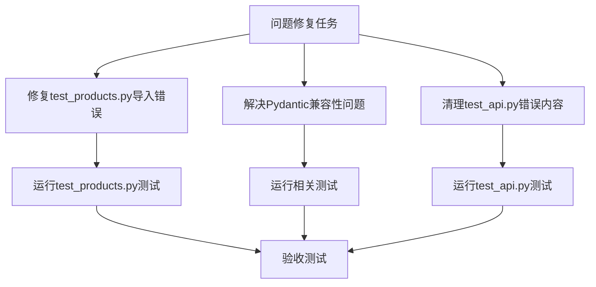

# 问题修复原子任务文档

## 子任务拆分

### 任务1: 修复test_products.py中的导入错误

#### 输入契约
- 前置依赖：[test_products.py](file:///Users/mac/TRAE/telegram%20bot/tests/test_products.py)文件存在导入错误
- 输入数据：当前的[test_products.py](file:///Users/mac/TRAE/telegram%20bot/tests/test_products.py)文件内容
- 环境依赖：Python 3.8+，FastAPI，SQLAlchemy

#### 输出契约
- 输出数据：修复后的[test_products.py](file:///Users/mac/TRAE/telegram%20bot/tests/test_products.py)文件
- 交付物：能够正常导入和运行的测试文件
- 验收标准：pytest能够正常运行该文件中的测试用例

#### 实现约束
- 技术栈：Python，FastAPI，pytest
- 接口规范：保持原有测试接口不变
- 质量要求：代码符合PEP8规范，无语法错误

#### 依赖关系
- 后置任务：运行[test_products.py](file:///Users/mac/TRAE/telegram%20bot/tests/test_products.py)测试
- 并行任务：无

### 任务2: 解决Pydantic版本兼容性问题

#### 输入契约
- 前置依赖：[product.py](file:///Users/mac/TRAE/telegram%20bot/app/schemas/product.py)中使用了Pydantic V1语法
- 输入数据：当前的[product.py](file:///Users/mac/TRAE/telegram%20bot/app/schemas/product.py)文件内容
- 环境依赖：Pydantic V2

#### 输出契约
- 输出数据：修复后的[product.py](file:///Users/mac/TRAE/telegram%20bot/app/schemas/product.py)文件
- 交付物：使用Pydantic V2语法的模型文件
- 验收标准：模型能够正常导入和使用

#### 实现约束
- 技术栈：Python，Pydantic V2
- 接口规范：保持模型接口不变
- 质量要求：代码符合PEP8规范，使用正确的Pydantic V2语法

#### 依赖关系
- 后置任务：运行相关测试
- 并行任务：任务1

### 任务3: 清理test_api.py中的错误内容

#### 输入契约
- 前置依赖：[test_api.py](file:///Users/mac/TRAE/telegram%20bot/tests/test_api.py)中存在重复和不必要的内容
- 输入数据：当前的[test_api.py](file:///Users/mac/TRAE/telegram%20bot/tests/test_api.py)文件内容
- 环境依赖：Python，pytest

#### 输出契约
- 输出数据：清理后的[test_api.py](file:///Users/mac/TRAE/telegram%20bot/tests/test_api.py)文件
- 交付物：简洁、正确的测试文件
- 验收标准：pytest能够正常运行该文件中的测试用例

#### 实现约束
- 技术栈：Python，pytest
- 接口规范：保持必要的测试接口不变
- 质量要求：代码简洁，无重复内容

#### 依赖关系
- 后置任务：运行[test_api.py](file:///Users/mac/TRAE/telegram%20bot/tests/test_api.py)测试
- 并行任务：任务1，任务2

## 任务依赖图

## 质量门控

1. 任务覆盖完整需求
2. 依赖关系无循环
3. 每个任务都可独立验证
4. 复杂度评估合理