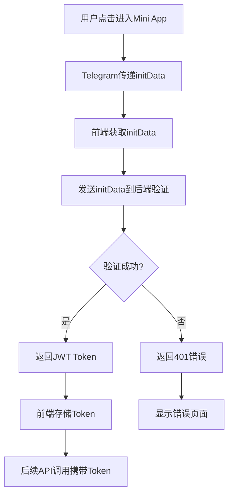

# 商家后台 Mini App 技术架构方案

## 1. 技术栈选型

### 前端核心
- **Framework**: React 18 + Vite 4
- **Language**: TypeScript 5.x
- **UI Library**: Ant Design Mobile 5.x
- **State Management**: Zustand + React Query
- **Router**: React Router v6
- **HTTP Client**: Axios with interceptors

### 构建工具
- **Build Tool**: Vite (快速热重载，优化打包)
- **Package Manager**: pnpm (更快的安装速度)
- **Code Quality**: ESLint + Prettier + Husky

### 部署方案
- **Hosting**: Vercel/Netlify (CDN全球加速)
- **Domain**: 独立子域名，如 `merchant.yourdomain.com`

## 2. 项目架构设计

```
merchant-mini-app/
├── src/
│   ├── components/          # 通用组件
│   │   ├── common/         # 基础组件 (Button, Input, etc.)
│   │   ├── business/       # 业务组件 (ProductCard, OrderItem, etc.)
│   │   └── layout/         # 布局组件 (Header, TabBar, etc.)
│   ├── pages/              # 页面组件
│   │   ├── Dashboard/      # 仪表板
│   │   ├── Products/       # 商品管理
│   │   ├── Orders/         # 订单管理
│   │   ├── Analytics/      # 数据分析
│   │   └── Settings/       # 设置页面
│   ├── hooks/              # 自定义 Hooks
│   │   ├── useAuth.ts      # 身份认证
│   │   ├── useApi.ts       # API 调用
│   │   └── useTelegram.ts  # Telegram API
│   ├── services/           # API 服务层
│   │   ├── auth.ts         # 认证服务
│   │   ├── merchant.ts     # 商家API
│   │   ├── product.ts      # 商品API
│   │   └── analytics.ts    # 数据API
│   ├── stores/             # 状态管理
│   │   ├── authStore.ts    # 用户状态
│   │   ├── merchantStore.ts # 商家状态
│   │   └── appStore.ts     # 应用状态
│   ├── types/              # TypeScript 类型定义
│   │   ├── api.ts          # API 响应类型
│   │   ├── merchant.ts     # 商家相关类型
│   │   └── telegram.ts     # Telegram 类型
│   ├── utils/              # 工具函数
│   │   ├── telegram.ts     # Telegram 相关工具
│   │   ├── format.ts       # 格式化函数
│   │   └── validation.ts   # 验证函数
│   └── App.tsx             # 根组件
├── public/                 # 静态资源
├── package.json
├── vite.config.ts          # Vite 配置
└── tsconfig.json           # TypeScript 配置
```

## 3. 身份认证架构

### 3.1 认证流程



### 3.2 认证中间件实现

```typescript
// src/services/auth.ts
import { WebApp } from '@twa-dev/types';

interface TelegramInitData {
  query_id?: string;
  user?: {
    id: number;
    first_name: string;
    last_name?: string;
    username?: string;
    language_code?: string;
  };
  auth_date: number;
  hash: string;
}

class AuthService {
  private token: string | null = null;
  
  async validateTelegramData(): Promise<string> {
    const webApp = window.Telegram?.WebApp;
    if (!webApp?.initData) {
      throw new Error('Telegram initData not found');
    }
    
    // 发送initData到后端验证
    const response = await fetch('/api/auth/telegram', {
      method: 'POST',
      headers: {
        'Content-Type': 'application/json',
      },
      body: JSON.stringify({
        initData: webApp.initData
      })
    });
    
    if (!response.ok) {
      throw new Error('Authentication failed');
    }
    
    const { token } = await response.json();
    this.token = token;
    localStorage.setItem('auth_token', token);
    
    return token;
  }
  
  getToken(): string | null {
    return this.token || localStorage.getItem('auth_token');
  }
  
  logout(): void {
    this.token = null;
    localStorage.removeItem('auth_token');
  }
}

export const authService = new AuthService();
```

## 4. 页面功能设计

### 4.1 仪表板 (Dashboard)
- 今日营业数据概览
- 待处理订单数量
- 商品浏览/收藏统计
- 快捷操作入口

### 4.2 商品管理 (Products)
- 商品列表（支持搜索筛选）
- 添加/编辑商品
- 批量操作（上架/下架）
- 商品图片上传

### 4.3 订单管理 (Orders)
- 订单列表（按状态分类）
- 订单详情查看
- 订单状态更新
- 客户沟通记录

### 4.4 数据分析 (Analytics)
- 访问统计图表
- 商品热度分析
- 收入趋势分析
- 客户画像分析

### 4.5 设置中心 (Settings)
- 商家信息编辑
- 营业时间设置
- 联系方式管理
- 订阅管理

## 5. 状态管理设计

### 5.1 认证状态
```typescript
// src/stores/authStore.ts
import { create } from 'zustand';

interface User {
  id: number;
  first_name: string;
  last_name?: string;
  username?: string;
}

interface AuthState {
  user: User | null;
  token: string | null;
  isAuthenticated: boolean;
  isLoading: boolean;
  login: (token: string, user: User) => void;
  logout: () => void;
  setLoading: (loading: boolean) => void;
}

export const useAuthStore = create<AuthState>((set) => ({
  user: null,
  token: null,
  isAuthenticated: false,
  isLoading: true,
  login: (token, user) => set({
    token,
    user,
    isAuthenticated: true,
    isLoading: false
  }),
  logout: () => set({
    token: null,
    user: null,
    isAuthenticated: false,
    isLoading: false
  }),
  setLoading: (isLoading) => set({ isLoading })
}));
```

### 5.2 商家状态
```typescript
// src/stores/merchantStore.ts
import { create } from 'zustand';

interface Merchant {
  id: number;
  name: string;
  description?: string;
  subscription_tier: 'free' | 'professional' | 'enterprise';
  subscription_status: string;
  // ... 其他字段
}

interface MerchantState {
  merchant: Merchant | null;
  stats: {
    totalProducts: number;
    totalOrders: number;
    totalViews: number;
  } | null;
  setMerchant: (merchant: Merchant) => void;
  setStats: (stats: any) => void;
}

export const useMerchantStore = create<MerchantState>((set) => ({
  merchant: null,
  stats: null,
  setMerchant: (merchant) => set({ merchant }),
  setStats: (stats) => set({ stats })
}));
```

## 6. API 集成层

### 6.1 HTTP 客户端配置
```typescript
// src/services/api.ts
import axios from 'axios';
import { authService } from './auth';

const api = axios.create({
  baseURL: process.env.VITE_API_BASE_URL || '/api',
  timeout: 10000,
});

// 请求拦截器：添加认证token
api.interceptors.request.use((config) => {
  const token = authService.getToken();
  if (token) {
    config.headers.Authorization = `Bearer ${token}`;
  }
  return config;
});

// 响应拦截器：处理错误
api.interceptors.response.use(
  (response) => response,
  (error) => {
    if (error.response?.status === 401) {
      authService.logout();
      window.location.href = '/login';
    }
    return Promise.reject(error);
  }
);

export { api };
```

### 6.2 API 服务封装
```typescript
// src/services/merchant.ts
import { api } from './api';

export interface MerchantCreateData {
  name: string;
  description?: string;
  region_id: number;
  address?: string;
  contact_phone: string;
}

export const merchantAPI = {
  // 获取当前商家信息
  getCurrent: () => api.get('/merchants/me'),
  
  // 创建商家
  create: (data: MerchantCreateData) => api.post('/merchants', data),
  
  // 更新商家信息
  update: (id: number, data: Partial<MerchantCreateData>) => 
    api.put(`/merchants/${id}`, data),
  
  // 获取统计数据
  getStats: (id: number) => api.get(`/merchants/${id}/stats`),
  
  // 升级订阅
  upgradeSubscription: (id: number, tier: string) =>
    api.post(`/merchants/${id}/upgrade`, { tier, auto_renew: false })
};
```

## 7. 性能优化策略

### 7.1 代码分割
- 路由级别的懒加载
- 组件级别的动态导入
- 第三方库的按需加载

### 7.2 缓存策略
- React Query 的智能缓存
- 图片资源的浏览器缓存
- API 响应的合理缓存时间

### 7.3 包大小优化
- Tree-shaking 移除未使用代码
- Vite 的自动代码分割
- 图片压缩和 WebP 格式

## 8. 开发和部署流程

### 8.1 开发环境
```bash
# 安装依赖
pnpm install

# 启动开发服务器
pnpm dev

# 类型检查
pnpm type-check

# 代码检查
pnpm lint
```

### 8.2 构建和部署
```bash
# 构建生产版本
pnpm build

# 预览构建结果
pnpm preview

# 部署到 Vercel
vercel --prod
```

### 8.3 环境变量配置
```env
# .env.production
VITE_API_BASE_URL=https://api.yourdomain.com
VITE_APP_NAME=商家后台
VITE_VERSION=1.0.0
```

## 9. 安全考虑

### 9.1 数据传输安全
- 全站 HTTPS 加密
- API 请求签名验证
- 敏感数据不在前端存储

### 9.2 认证安全
- Telegram initData 哈希验证
- JWT Token 定期刷新
- 自动登出机制

### 9.3 前端安全
- XSS 防护
- CSRF Token 验证
- 输入数据验证和清理

## 10. 监控和错误处理

### 10.1 错误边界
- 全局错误捕获
- 优雅的错误页面
- 错误信息上报

### 10.2 性能监控
- 页面加载时间监控
- API 响应时间监控
- 用户行为分析

这个架构方案确保了 Mini App 的高性能、可维护性和用户体验，为商家提供了完整的移动端管理解决方案。